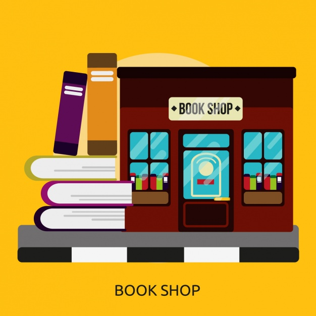

# Bookshop

A bookshop that will provide the final amount to be paid for a given list of books. 

Each book has a title, price, and year.

This bookshop has certain discounts. The following are the currently available discounts:

* All books published after 2000 have 10% discount.
* Buy books worth more than £30 in total, get a 5% discount on the total.

The book shop currrently sells the following books:

Title | Year | Price
:-------------------------------------| ------| ------- |
Moby Dick                             |(1851) | £15.20  |
The Terrible Privacy of Maxwell Sim   |(2010) | £13.14  |
Still Life With Woodpecker            |(1980) | £11.05  |
Sleeping Murder                       |(1976) | £10.24  |
Three Men in a Boat                   |(1889) | £12.87  |
The Time Machine                      |(1895) | £10.43  |
The Caves of Steel                    |(1954) | £8.12   |
Idle Thoughts of an Idle Fellow       |(1886) | £7.32   |
A Christmas Carol                     |(1843) | £4.23   |
A Tale of Two Cities                  |(1859) | £6.32   |
Great Expectations                    |(1861) | £13.21  |

